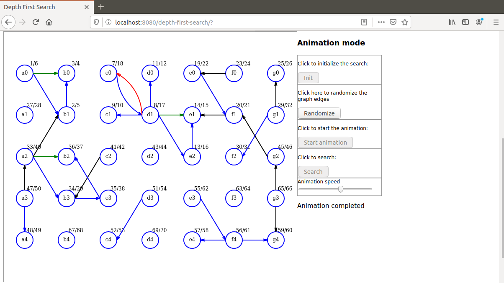

# depth-first-search-forest
Java based demonstration of Depth First Search algorithm using HTML5 Canvas, Javascript and AJAX with animation.

I present here a Java based demonstration of the Depth First Search algorithm.

The algorithm itself is implemented in Java. Javascript is used for initialization and display only.

The browser sends a single Ajax request to the server that sends back a response that contains a collection of all intermediate search results with a new discovery at each step. Then this collection is used for animation.

To launch the demo run the command `mvn spring-boot:run` in project directory. When the application has started open a browser and hit URL `localhost:8080/depth-first-search`

The algorithm starts with a a directed graph and ends with a forest.
 
Here is a screen shot that can be seen during a demo:

For a video demo follow this link:

https://youtu.be/42W9TgT1Ei0

For a step-by-step demonstration of the DFS algorithm please visit this repository:

https://github.com/dubersfeld/depth-first-search-step

Dominique Ubersfeld, Cachan, France
